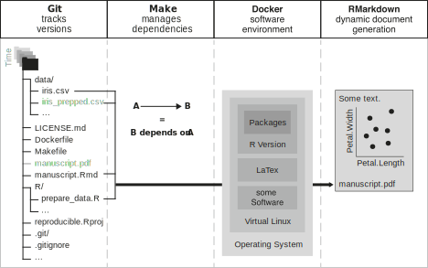

class: center

# Replication ≠ Reproduction

<br>

## Replicability: 
### Same conclusion from same analysis and new data

<br>
--

## Reproducibility: 
### Same conclusion from same analysis and same data

---


class: clear middle center large

## Your closest collaborator is you six months ago, but you don’t reply to emails.

.footnote[From Karl Broman's lecture on reproducibility, paraphrasing Mark Holden]

---

# Reproducibility is hard!

- Hardwicke et al. (2018): Out of 35 articles in _Cognition_, 22 could be reproduced but 11 of those required authors' assistance. For 13 articles, at least one outcome could not be reproduced even with the original authors' assistance.

--

- Obels et al. (2020) show that in 62 Registered Reports, 41 had data available, 37 had analysis scripts available. The authors could run 31 of the scripts and reproduced 21 articles (within reasonable amount of time)

.footnote[https://doi.org/10.1098/rsos.180448 and https://doi.org/10.1177%2F2515245920918872]

---

# Sources of Failure to Reproduce Results


.pull-right[  ]

1. *Multiple versions of scripts/data* (e.g., dataset has changed over, i.e., was further cleaned or extended)

--

2. *Multiple scripts* in a pipeline; unclear which scripts should be executed in which order

--

3. *Copy&paste errors* (e.g., inconsistency between reported result and reproduced result)

--

4. Ill-defined *software dependencies* (e.g., incompatible version, missing package)

---

class: left, middle, inverse
background-image: url(http://3.bp.blogspot.com/-c7bI_n5oXd0/U7vTYArmRoI/AAAAAAAAKoQ/3JkxLM2PRKo/s1600/gospels-meme.jpg)
background-position: right

# Famous Examples

---


### 1.	Bugfix in random number generator in R between R 3.5 and R 3.6

```{r eval=FALSE}
set.seed(1234); 
sample(1:10, 5) 
```

--

```{r eval=FALSE}
2 6 5 8 9 (R3.5)
```

--

```{r eval=FALSE}
10 6 5 4 1 (R3.6.1)
```

---

# Examples of Non-Reproducible Code in R

Confidence intervals (95%) of a simple regression coefficient estimate (with identical random seed):

.pull-left[
```{r eval=FALSE}
[1] "R version 3.5.0 (2018-04-23)"

2.5 % 97.5 %
 0.0097 0.3842
```
]

--

.pull-right[
```{r eval=FALSE}
 [1] "R version 3.6.1 (2019-07-05)"

 2.5 % 97.5 %
 -0.0005 0.3748
```
]

.footnote[Note that even though the results are not reproduced, they replicated.]

---

#  Examples of Non-Reproducible Code in R
	
### 2.	Locale-dependent behavior (e.g., English vs Lithuania):

````{r eval=FALSE}
sort(state.abb) 

[1] "AK" "AL" "AR" "AZ" "CA" "CO" "CT" "DE" "FL" "GA" "HI" "IA" 
[13] "ID" "IL" "IN" "KY" "KS" "LA" "MA" "MD" "ME" "MI" "MN" "MO" 
[25] "MS" "MT" "NC" "ND" "NE" "NH" "NY" "NJ" "NM" "NV" "OH" "OK" 
[37] "OR" "PA" "RI" "SC" "SD" "TN" "TX" "UT" "VA" "VT" "WA" "WI" 
[49] "WY" "WV"
```

---

# Four Elements of Reproducibility

<center>

</center>

<!--.footnote[from Peikert and Brandmaier (2020)]
-->
---

# Preregistration

## Preregistration:

> Specifying your research plan in advance of your study and submitting it to a registry.

## Goals:

- Clear Separation of hypothesis-generating (exploratory) and hypothesis-testing (confirmatory) research. 
- Reducing _undisclosed_ researchers degrees-of-freedom

---

# Shortcomings of preregistrations

* It's just a lot of extra work
* Is anybody ever going to read the preregistration other than the reviewers?
* Residual ambiguity
* Difficult to compare to final manuscript to examine deviations from preregistration (which are OK!)

---

# Solution: *PAC: Preregistration as Code*

1. Preregister reproducible document with draft of manuscript
2. Include all code for planned analyses
3. Use fake (simulated/synthetic) data to obtain placeholder results
4. Draft everything up to including _Results_ section based on placeholder results

After collecting real data:

5. Re-compile document 
6. Write _Discussion_ section
7. Publish

---

# Advantages

* Extra work / is anybody going to read it?
    + You're not writing a separate document, but an early version of the final manuscript
    + You need to write code to analyze the data anyway
* Ambiguity
    + You become aware of ambiguity in your planned analysis when you start actually running it 
   *  Difficult to compare
    + All changes are tracked in code (e.g., via github)

---

# Bayesian Preregistration

> 
Authors should indicate what distribution will be used to represent the predictions of the theory and how its parameters will be specified. For example, will you use a uniform up to some specified maximum, or a normal/half-normal to represent a likely effect size (Dienes, 2011), or a JZS/Cauchy with a specified scaling constant (Rouder et al., 2009)? The parameters need not be stated in advance, but where unstated, authors must indicate what aspect of data will be used to set those parameters

Bayesian analyis may increase researchers degrees-of-freedom (Simmons, Nelson, and Simonsohn, 2011)

---

# Bayesian PAC

- PAC easily extends to Bayesian methods
- Sharing reproducible code may empower others (reviewers, editors, readers) to specify their own priors 
- Bayesian PAC may enable us to elicit expert priors
- We can either do different what-if-scenarios (subjunctive priors) or mixture priors
- Extreme scenario: A call for priors is issued along with the preregistration


---

# Reviewers' (subjunctive) priors

.pull-left[ 
- divergent beliefs
- one group beliefs in a negative effect and one group in a narrower effect
- less uncertainty associated with the belief in the narrower effect. - plus a broad and uninformed believe (editor)
- posterior belief is a mixture (black)
]

.pull-right[ 
```{r message=FALSE, warning=FALSE,echo=FALSE}

x <- seq(-1,.5,.01)
y <- 0.44*dnorm(x, mean=-0.49,sd=.14)+ .56*dnorm(x,mean=-.19,sd=0.06)
rw <- 39/120.0
y2 <- rw*y+(1-rw)*dnorm(x,mean=0,sd=1)
y3 <- dnorm(x,mean=0,sd=1)

plot(x,y,type="l")
lines(x,y2,type="l",lwd=2)
lines(x,y3,type="l",lty=2)


df <- data.frame(cbind(x=rep(x,3),y=c(y,y2,y3),Legend=rep(1:3,each=length(y))))

df$Legend <- factor(df$Legend,labels = c("Informed prior","Posterior Mixture","Uninformed prior"))

gpl <- ggplot(data = df,mapping=aes(x = x,y=y,group=Legend,color=Legend))+geom_line(size=1)+theme_minimal()+
  scale_colour_hc()+ theme_hc()
```
]
---

# Let's discuss


---